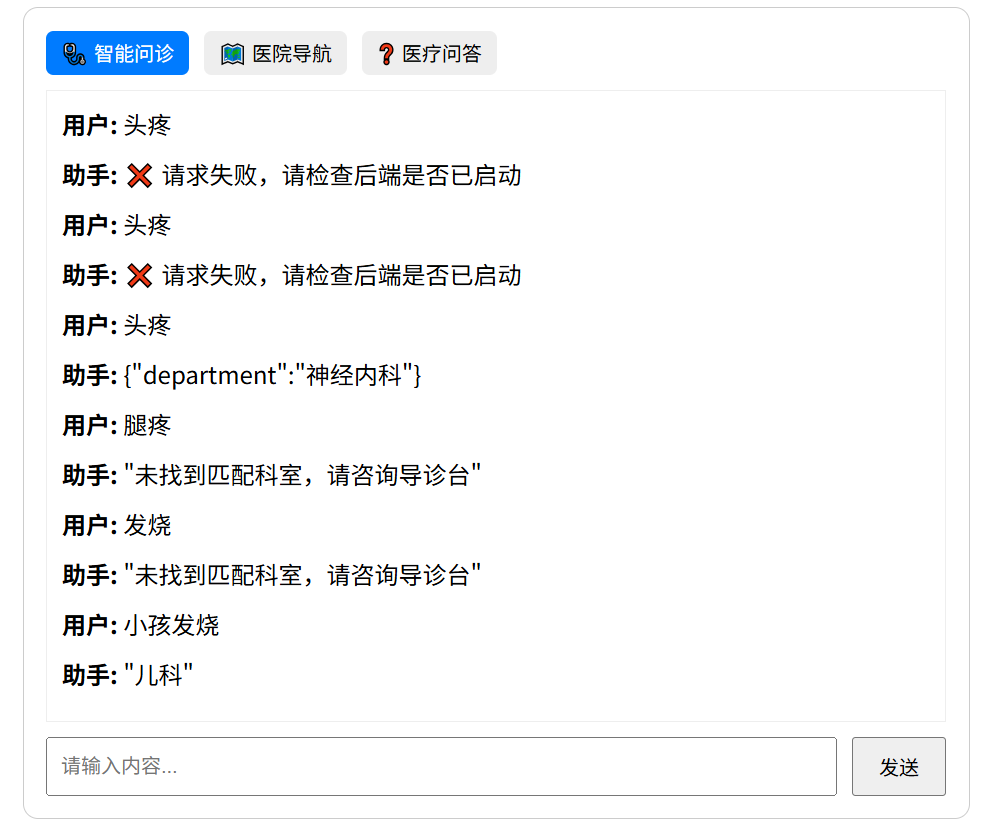
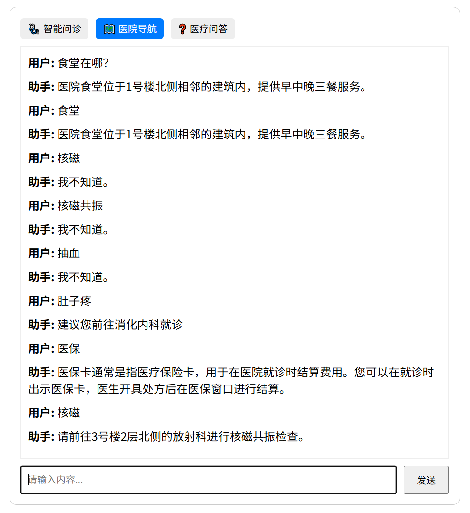
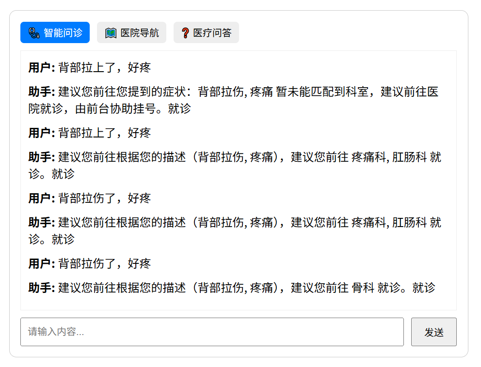

智能医疗问答系统开发文档

#一、项目概述

本项目为智能医疗问答系统的开发记录，通过多版本迭代实现从基础规则匹配到结合大模型、知识图谱的智能交互。系统包含智能问诊、医院导航、医疗问答三大核心功能，逐步引入 LangChain、FAISS、Qwen2 等技术优化体验，最终目标为构建支持多模态交互与知识图谱查询的智能医疗助手。

#二、功能迭代与效果展示

v1 版本：基础规则匹配（非智能版本）

技术实现：本地规则引擎 + 精确字符串匹配（不使用 LangChain）

核心接口：/symptom（症状匹配）、/navigate（导航）、/qa（问答）

功能限制：仅支持完全精确匹配，无法处理模糊查询

示例对话：

plaintext

用户：头疼 → 助手：{"department":"神经内科"}（精确匹配）

用户：腿疼 → 助手："未找到匹配科室, 请咨询导诊台"（无精确匹配）

用户：做核磁共振去哪? → 助手："请前往3号楼2层北侧的放射科"（精确关键词匹配）

效果截图：

智能问诊

 

医院导航

 

v2 版本：LangChain+RAG 模型（支持模糊查询）

技术升级：LangChain + FAISS 向量数据库 + 本地 Embedding 模型

核心优化：

统一接口为/chat，支持模糊查询与多轮对话

文档向量化存储，提升非精确匹配能力

示例对话：

plaintext

用户：食堂 → 助手："医院食堂位于1号楼北侧相邻的建筑内..."（模糊匹配）

用户：肚子疼 → 助手："建议您前往消化内科就诊"（语义理解）

用户：核磁 → 助手："请前往3号楼2层北侧的放射科"（模糊关键词匹配）

效果截图：

 

v3 版本：提示词工程 + 模糊匹配优化

技术实现：

双提示词链：

① 提取自然语言中的症状关键词（如从 "右边腰很酸" 提取 "腰酸"）

② 归一化模糊词汇为标准症状（如 "疼痛"→"背痛"）

使用difflib.get_close_matches实现模糊匹配

效果对比：

 

改进前：输入 "背部疼痛" 无法匹配数据库中 "背痛" 词条（截图 1）

改进后：

单提示词：错误匹配 "背部拉伤"（截图 2-3）

双提示词 + 模糊匹配：正确关联 "背痛"（截图 4）

关键代码：

from difflib import get_close_matches

# 症状归一化逻辑

    def normalize_symptom(user_input, standard_symptoms):
        matches = get_close_matches(user_input, standard_symptoms, n=1, cutoff=0.6)
        return matches[0] if matches else user_input

v4 版本：多模态交互（语音支持）

v4.1：语音回答

工具：gTTS（文本转语音），支持流式输出，无需预先生成文件

依赖：pip install gTTS

v4.2：语音输入

尝试方案：

faster-whisper（因 OpenMP 库冲突放弃，需强制线程数为 1）

浏览器 Web Speech API（仅 Chrome 支持）

最终方案：采用vosk实现语音识别，兼容多浏览器

依赖：pip install vosk

v5 版本：知识图谱 + 多轮问诊

v5 尚未实现

技术栈：Neo4j 知识图谱 + 多轮对话记忆
核心功能：
医疗知识图谱问答（如疾病 - 症状 - 科室关联查询）
多轮问诊流程（记忆历史症状，如 "先头疼后发烧"→综合建议）
待扩展功能：记录历史病历，结合病历数据优化诊断

三、技术选型与依赖

版本	关键技术 / 工具	说明

v1	Python 字符串匹配	纯规则引擎，无第三方库依赖

v2	LangChain, FAISS, Embedding	文档向量化（如 Sentence-BERT），需pip install langchain faiss-cpu

v3	difflib, 提示词工程	自然语言处理优化，Python 内置库

v4	gTTS, vosk	语音功能，需安装对应库

v5	Neo4j, 对话状态管理	知识图谱存储，需部署 Neo4j 数据库

通用	Vue3（前端）	交互界面开发，需与后端联调跨域配置

# 四、部署与运行
环境准备
后端：Python 3.10+，安装依赖：

bash

    pip install -r requirements.txt

前端：Node.js 环境，安装依赖：

bash

    cd frontend && npm install

启动命令

后端服务：

bash

    python backend/app.py --port 8000  # 启动v5版本服务（默认端口8000）

前端界面：

bash

    cd frontend && npm run dev  # 访问http://localhost:3000

六、未来规划 - v5版本尚未实现

数据增强：引入电子病历与临床指南，扩展知识图谱实体关系

功能扩展：

集成影像识别接口（如 X 光片初步分析）

对接医院 HIS 系统，实现挂号、检查预约等功能

性能优化：量化 Qwen2-7B 模型（如 4bit 量化），降低显存占用至 6GB 以内

